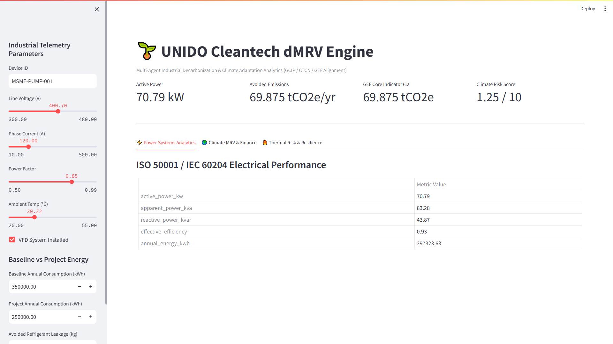
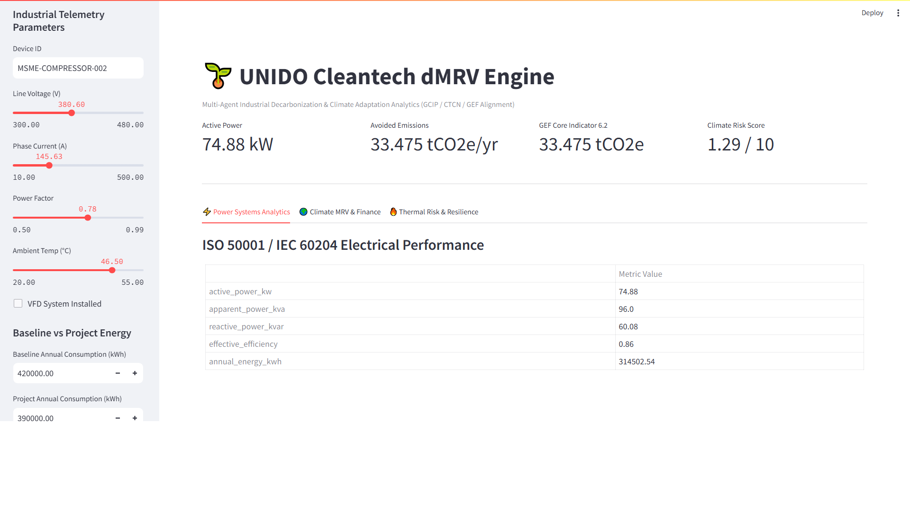
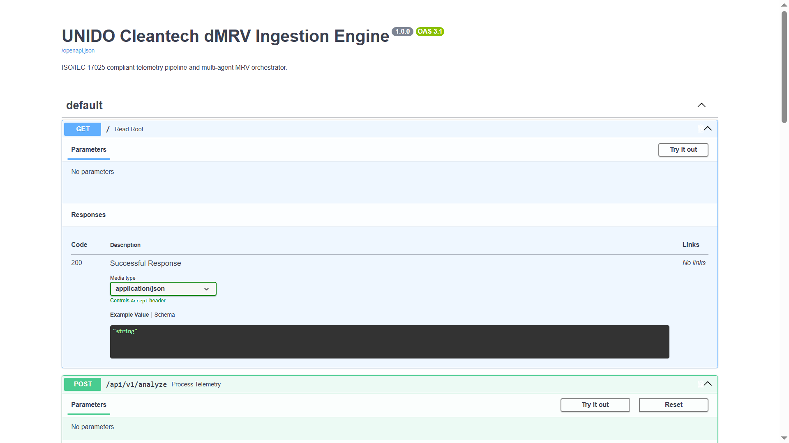
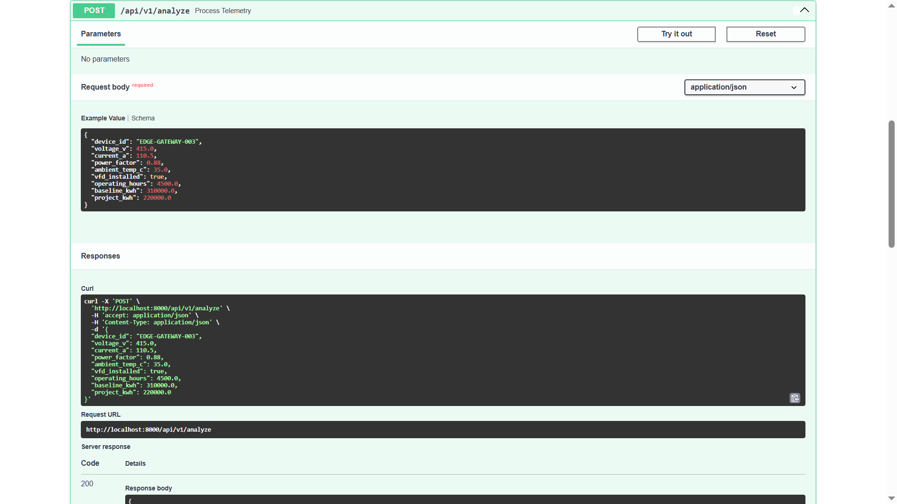
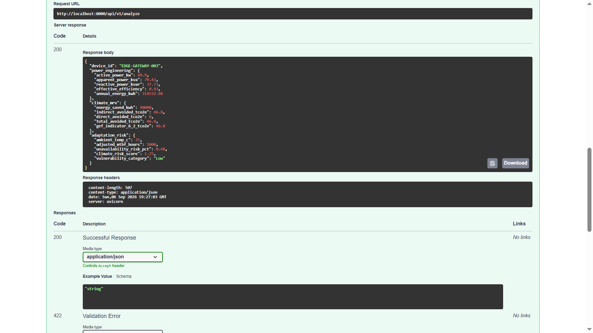

# UNIDO Cleantech MRV Agent

[](https://opensource.org/licenses/MIT)
[](https://www.python.org/downloads/)
[]()
[]()

> **An Open-Source Multi-Agent Digital MRV and Adaptive Climate Impact Engine for Industrial MSMEs in Developing Nations**

---

## Overview

`unido-cleantech-mrv-agent` is an open-source decision-support and Measurement, Reporting, and Verification (MRV) platform for industrial cleantech applications.

The platform is designed as a research and engineering prototype that can support use cases related to:

* Industrial energy efficiency
* Greenhouse gas (GHG) measurement and reporting
* Climate adaptation and thermal resilience
* Industrial telemetry analysis
* Power systems analytics
* Digital and tamper-evident audit trails

The system ingests industrial energy and thermal telemetry, applies specialized analytical agents, and produces traceable climate and energy performance indicators.

---

## System Architecture

```text
+------------------------+
| Industrial IoT Data    |
+------------------------+
            |
            v
+------------------------+
| Data Validation Layer  |
| and Quality Checks     |
+------------------------+
            |
            v
+------------------------+
| Multi-Agent MRV Engine |
+------------------------+
            |
            v
+-------------------+-------------------+-------------------+
| Power Systems     | Climate MRV       | Adaptation Risk   |
| Agent             | Agent             | Agent             |
+-------------------+-------------------+-------------------+
            |
            v
+-----------------------------------------------------------+
| Climate, Energy, MRV and Decision-Support Reporting       |
+-----------------------------------------------------------+
```

---

## Key Features

### Automated Digital MRV

Supports continuous ingestion and analysis of industrial data for energy and greenhouse gas accounting.

Potential applications include:

* High-efficiency cooling systems
* Heat pumps
* Variable Frequency Drives (VFDs)
* Industrial motors
* HVAC systems
* Energy-efficiency retrofits

### Power Quality and Energy Analytics

Supports engineering analysis of:

* Voltage unbalance
* Power factor
* Total Harmonic Distortion (THD)
* Electrical energy consumption
* Equipment efficiency
* Mechanical and electrical losses

### Low-GWP Refrigerant Analysis

Supports baseline-to-project analysis for refrigerant transition scenarios, including:

* Refrigerant leakage
* Global Warming Potential (GWP)
* Direct emissions
* Energy-related indirect emissions

### Climate Adaptation and Thermal Risk

Supports analysis of:

* Elevated ambient temperatures
* Equipment derating
* Thermal stress
* Asset availability
* Operational resilience

### Tamper-Evident Verification

Supports cryptographic hashing and tamper-evident audit records for MRV workflows.

---

## UN Sustainable Development Goals

| SDG                                                 | Application                                                             |
| --------------------------------------------------- | ----------------------------------------------------------------------- |
| **SDG 7 - Affordable and Clean Energy**             | Supports industrial energy efficiency and energy performance analysis.  |
| **SDG 9 - Industry, Innovation and Infrastructure** | Supports digital industrial monitoring, IoT, and engineering analytics. |
| **SDG 13 - Climate Action**                         | Supports measurement and tracking of greenhouse gas reductions.         |

---

# Mathematical and Engineering Formulation

## 1. Avoided Emissions Calculation

The net greenhouse gas mitigation can be represented as:

```text
Total Avoided Emissions
=
(Baseline Electricity - Project Electricity)
x Grid Emission Factor

+

Refrigerant Emissions Avoided
```

A more detailed formulation is:

```text
Avoided Emissions
=
[(E_base - E_project) x EF_grid]

+

[Sum((L_base - L_project) x GWP)] / 1000
```

Where:

* `E_base` = Baseline electrical energy consumption in kWh
* `E_project` = Project electrical energy consumption in kWh
* `EF_grid` = Grid emission factor in kg CO2e per kWh
* `L_base` = Baseline refrigerant leakage in kg
* `L_project` = Project refrigerant leakage in kg
* `GWP` = Global Warming Potential

The final result may be expressed in:

```text
tCO2e
```

---

## 2. Temperature Derating

A simplified temperature derating model is:

```text
Actual Efficiency
=
Rated Efficiency
x
[1 - alpha x max(0, Ambient Temperature - Rated Temperature)]
```

Where:

* `alpha` = Thermal derating coefficient
* `Ambient Temperature` = Actual operating ambient temperature
* `Rated Temperature` = Equipment rated operating temperature

---

## 3. Asset Availability and Thermal Risk

A simplified risk model may use:

```text
Availability Risk
=
1 - MTTR / Adjusted MTBF
```

Where:

* `MTTR` = Mean Time To Repair
* `MTBF` = Mean Time Between Failures

Temperature-dependent reliability factors may be incorporated into the adjusted MTBF calculation.

---

# Quickstart

## Prerequisites

* Python 3.11 or later
* Git
* Docker
* Docker Compose

---

## Local Installation

### Clone the Repository

```bash
git clone https://github.com/phahim1/unido-cleantech-mrv-agent.git
```

### Enter the Repository

```bash
cd unido-cleantech-mrv-agent
```

### Create a Virtual Environment

```bash
python3 -m venv venv
```

### Activate the Environment

Linux or macOS:

```bash
source venv/bin/activate
```

Windows:

```bash
venv\Scripts\activate
```

### Install Dependencies

```bash
pip install -r requirements.txt
```

---

# Running with Docker

Build and start the application:

```bash
docker-compose up --build
```

If the configured services are available, the application may be accessible at:

### Streamlit Dashboard

```text
http://localhost:8501
```

### FastAPI Documentation

```text
http://localhost:8000/docs
```

---

# Example Usage

```python
from src.agents.power_engineering import PowerEngineeringAgent
from src.agents.climate_mrv import ClimateMRVAgent


# Initialize agents

power_agent = PowerEngineeringAgent()

mrv_agent = ClimateMRVAgent(
    grid_ef_kg_kwh=0.52
)


# Example industrial telemetry

telemetry_data = {
    "voltage_v": 400,
    "current_a": 120,
    "power_factor": 0.82,
    "operating_hours": 4200,
    "vfd_installed": True
}


# Analyze efficiency

power_metrics = power_agent.analyze_efficiency(
    telemetry_data
)


# Calculate avoided emissions

mrv_results = mrv_agent.compute_avoided_emissions(
    baseline_kwh=315000,
    project_kwh=220500,
    refrigerant_leakage_saved_kg=12.5,
    gwp=1430
)


print(
    "Annual Avoided Emissions:",
    f"{mrv_results['total_avoided_tco2e']:.2f}",
    "tCO2e"
)


print(
    "MRV Indicator Contribution:",
    f"{mrv_results['gef_indicator_6_2_tco2e']:.2f}",
    "tCO2e"
)
```

---

# Repository Structure

```text
unido-cleantech-mrv-agent/

data/
    reference/
    samples/

docs/
    architecture/
    mappings/

src/
    agents/
        power_engineering.py
        climate_mrv.py
        adaptation_risk.py

    ingestion/

    mrv_core/

    reporting/

tests/
```

---

# Verification and Testing

Run the test suite:

```bash
pytest tests/ -v --cov=src
```

The testing framework can be used to validate:

* Engineering calculations
* Power-quality metrics
* Energy-efficiency calculations
* GHG and MRV calculations
* Refrigerant emission calculations
* Climate adaptation calculations
* Thermal-risk calculations
* Cryptographic verification outputs

---

# Verification Philosophy

The platform follows four core principles.

## 1. Measurement

Ingest structured industrial telemetry and relevant reference data.

## 2. Calculation

Apply transparent engineering and emissions-accounting calculations.

## 3. Verification

Maintain calculation traceability through validation and tamper-evident records.

## 4. Reporting

Translate technical and engineering outputs into decision-support indicators.

The objective is to provide a traceable pathway from industrial measurements to energy and climate-impact reporting.


---

## Field Use Cases & Programmatic Verification

### Use Case 1: Industrial MSME Decarbonization (GEF Core Indicator 6.2)



**Operational Scenario & Mechanics**
Monitors an industrial motor retrofit utilizing a Variable Frequency Drive (VFD) under ISO 50001 and IEC 60204 standards. The engine ingests baseline vs. active electrical telemetry ($kWh$, Power Factor, $kW$) to calculate net avoided emissions ($\Delta E_{\text{total}}$) and direct global warming potential reductions from refrigerant management.

**Key UNIDO Benefits & Strategic Alignment**
* **Programmatic Impact:** Directly aligns with UNIDO MTPF priorities for clean industrial transitions and the Global Cleantech Innovation Programme (GCIP).
* **Climate Finance Readiness:** Automatically generates audit-ready data for **GEF Core Indicator 6.2** ($tCO_2e$ avoided), accelerating disbursement approvals from multilateral funds (GEF/GCF/ASIF).
* **MSME Scalability:** Provides small-to-medium enterprises with transparent, automated dMRV without requiring expensive on-site third-party auditing infrastructure.

---

### Use Case 2: Extreme Thermal Stress & Asset Derating (Climate Adaptation)






**Operational Scenario & Mechanics**
Evaluates industrial equipment performance under severe heat stress ($T_{\text{ambient}} > 40^\circ\text{C}$). Utilizing thermal derating ($\alpha$) and exponential failure risk models ($A_{\text{risk}}$), the agent quantifies efficiency losses and Mean Time Between Failures (MTBF) degradation in real time.


**Key UNIDO Benefits & Strategic Alignment**
* **Programmatic Impact:** Operationalizes Climate Technology Centre and Network (CTCN) adaptation frameworks by embedding climate resilience into industrial energy management.
* **Risk Mitigation:** Offers early-warning diagnostic indicators to prevent catastrophic equipment failures and unplanned production downtime in high-temperature target regions.
* **Capital Protection:** Informs targeted capital expenditure and preventative maintenance scheduling to extend asset lifespans under shifting climate baselines.

---

### Use Case 3: ISO/IEC 17025 Compliant IoT Telemetry Ingestion Gateway






**Operational Scenario & Mechanics**
Demonstrates an asynchronous REST API built on FastAPI that ingests raw three-phase electrical telemetry ($V$, $I$, $\text{PF}$, $T_{\text{ambient}}$) directly from edge IoT meters. The gateway validates telemetry against strict schema rules before routing payloads to specialized dMRV analytical agents.

**Key UNIDO Benefits & Strategic Alignment**
* **Programmatic Impact:** Delivers a digital-first, standards-compliant dMRV architecture capable of managing multi-country pilot project portfolios concurrently.
* **Data Provenance & Trust:** Enforces ISO/IEC 17025 data integrity and calibration controls to eliminate manual reporting bias and greenwashing risks.
* **Interoperability:** Connects edge hardware directly with UNIDO central reporting dashboards via open-source OpenAPI specifications.


---

# Future Roadmap

## 1. Multi-Agent and MCP Integration

Future development may include standardized agent communication protocols and distributed agent architectures.

Potential capabilities include:

* Autonomous agent collaboration
* Modular microservices
* Agent-to-agent communication
* Structured context exchange
* Distributed engineering analytics

---

## 2. AI-Assisted Engineering Diagnostics

Future versions may integrate Small Language Models (SLMs) or other AI models to generate:

* Technical audit summaries
* Equipment diagnostics
* Telemetry anomaly explanations
* Engineering recommendations
* Natural-language reports

AI-generated recommendations should remain subject to engineering and human review.

---

## 3. Tamper-Evident Audit Trails

Future development may include:

* Cryptographic hashing
* Immutable audit records
* Distributed ledger integration
* Verification timestamps
* Calculation provenance

Distributed ledger integrations may include Hedera-based implementations where appropriate.

---

## 4. Edge and Industrial Protocol Integration

Future versions may support direct industrial data ingestion through:

* Modbus
* MQTT
* Industrial gateways
* Edge devices
* Offline data caching

Potential deployment environments include:

* Raspberry Pi-class devices
* Industrial gateways
* Factory edge computers
* Containerized services

---

## 5. Predictive Maintenance

Future development may include:

* Vibration monitoring
* FFT analysis
* Harmonic analysis
* Motor condition monitoring
* Equipment anomaly detection
* Predictive maintenance models

---

## 6. Standards and Regulatory Expansion

Potential future research areas include:

* Measurement uncertainty modelling
* Calibration workflows
* Industrial emissions accounting
* Supply-chain emissions
* Scope 3 analysis
* Embodied carbon
* CBAM-related reporting scenarios

---

# Disclaimer

This repository is an **open-source research and decision-support prototype**.

References to UNIDO programmes, GEF/GCF indicators, ISO standards, IEEE standards, the Kigali Amendment, IPCC methodologies, or other international frameworks do not imply:

* Endorsement
* Certification
* Accreditation
* Official approval
* Official affiliation

unless explicitly stated.

Actual MRV, greenhouse gas accounting, climate-finance reporting, certification, or regulatory submissions should be performed or validated by appropriately qualified professionals using the applicable methodologies, standards, regulations, and jurisdictional requirements.

---

# License

Distributed under the MIT License.

See the `LICENSE` file for details.
